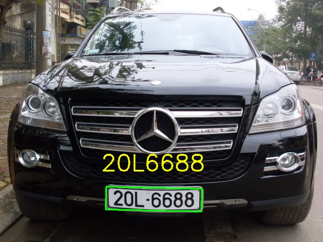

# IPSScar - module đọc biển số xe hơi Việt Nam



## Tính năng
- Đọc biển số xe hơi biển vuông & biển dài
- Đọc được biển số theo thông tư 58: biển vàng và font chữ mới
- Có thể setup góc xoay nếu vị trí camera lắp đặt không trực diện
- Đọc được biển 4 số và 5 số


## Demo chức năng
Để test độ chính xác của phần mềm quý khách có thể chạy chương trình build sẵn (.exe) tại đường dẫn:
```
IPSScar\windows\bin\ExampleCs\IPSScar.exe
```

Quý khách cần cài đặt thư viện để chạy chương trình:
- Microsoft .NET Framework 4.5.2: https://www.microsoft.com/en-us/download/details.aspx?id=42642
- C++ Redistributable 2015 x86: 		https://www.microsoft.com/en-us/download/details.aspx?id=48145

## Build source code example

Để hiểu cách tích hợp module vào phần mềm cổng kiểm soát bãi xe chúng tôi có kèm theo source code example cách gọi hàm.

Thông tin về source code example:
- Viết bằng ngôn ngữ C#
- Có 2 phiên bản x86 và x64
- Build bằng Visual Studio 2015 trở lên
- Chạy trên Window 7 SP1 trở lên
- Kết quả trả về bao gồm: ký tự biển số, mã lỗi (nếu có), loại biển, màu biển.
	
	
## Thông tin liên hệ
	
Trang chủ: https://viscomsolution.com/ipss-phan-mem-doc-bien-so-xe-may-xe-hoi/